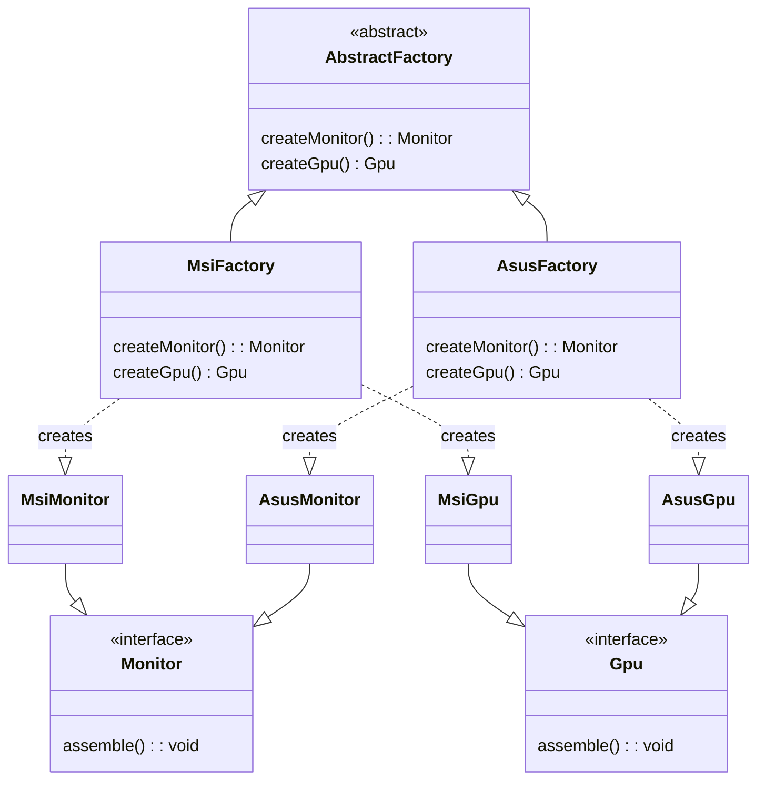

# The Abstract Factory Pattern

The abstract factory enables is a generic abstract class that contains the methods to create the interfaces.

Note that this is returning interfaces rather than concrete implementations.

## The class Diagram for the Abstract Factory



#### AbstractFactory.java

```java {filename="AbstractFactory.java"}
public abstract class AbstractFactory {
    public abstract Monitor createMonitor();
    public abstract Gpu createGpu();
}
```

Using the abstract factory, concrete factories can be produced implementing the same methods. These contain the functionality to return the required objects.

#### MsiFactory.java

```java
public class MsiFactory extends AbstractFactory {
    @Override
    public Monitor createMonitor() {
        return new MsiMonitor();
    }

    @Override
    public Gpu createGpu() {
        return new MsiGpu();
    }
}
```

#### AsusFactory.java

```java
public class AsusFactory extends AbstractFactory {
    @Override
    public Monitor createMonitor() {
        return new AsusMonitor();
    }

    @Override
    public Gpu createGpu() {
        return new AsusGpu();
    }
}
```

The objects are defined by interfaces

```java
public interface Gpu {
    void assemble();
}

public interface Monitor {
    void assemble();
}
```

These interfaces are implemented to create the classes.

```java
public class MsiGpu implements Gpu {
    @Override
    public void assemble() {
        // Gpu Logic
        System.out.println("Assembling msi gpu");
    }
}

public class MsiMonitor implements Monitor {
    @Override
    public void assemble() {
        // Business logic
    }
}

public class AsusGpu implements Gpu {
    @Override
    public void assemble() {
        // Business logic
        System.out.println("Assembling an asus GPU");
    }
}

public class AsusMonitor implements Monitor {
    @Override
    public void assemble() {
        // Business logic
    }
}
```

The factory can be used by the developer:

```java
public class Main {

    public static void main(String[] args) {
        AbstractFactory asusFactory = new AsusFactory();
        Gpu asusGpu = asusFactory.createGpu();
        asusGpu.assemble();
    }
}
```
