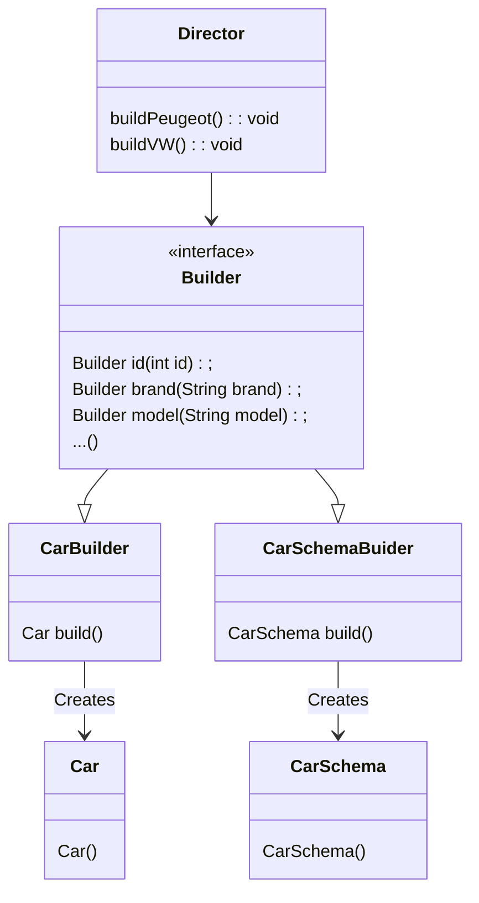

# The Builder Design Pattern

A creational design pattern that lets you create complex objects on a step by step basis. 
It lets you produce different types and representations of objects using the same construction process.

[The Builder Pattern Explained and Implemented in Java | Creational Design Patterns | Geekific
](https://www.youtube.com/watch?v=MaY_MDdWkQw)




The Builder interface contains all the methods to build the various components.
Each of these returns the same builder.

The concreteBuilders implement the Builder interface, but also include a method to build the Object. 
This calls the object's constructor.

The director contains various methods to build combinations of the objects using the builder interface.
```java
public class Director {

    public void buildPeugeot(Builder builder){
        builder.brand("Peugeot")
                .id(1111)
                .color("Red")
                .nbrDoors(5)
                .screenType("Wide");
    }

    public void buildVW(Builder builder){
        builder.brand("VW")
                .id(2222)
                .color("Green")
                .nbrDoors(3)
                .screenType("Wide")
                .height(44);
    }
}
```
Any Builder that implements the Builder interface can use these methods.
Because we have builders for both the Car and the CarSchema, both implementing the Builder interface, both of these can call the Director methods.
```java
public class Main {
    public static void main(String[] args) {
        Director director = new Director();

        CarBuilder carBuilder = new CarBuilder();
        director.buildPeugeot(carBuilder);
        Car peugeot = carBuilder.build();

        CarSchemaBuilder carSchemaBuilder = new CarSchemaBuilder();
        director.buildPeugeot(carSchemaBuilder);
        CarSchema peugeotManual = carSchemaBuilder.build();
    }
}
```
Here, a builder of each type is created and passed to the director methods.
The director applies the steps.
The object can then be build.